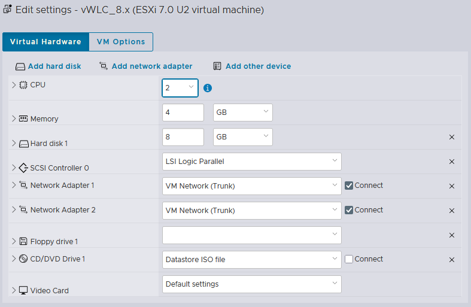

# Cisco vWLC (Virtual Wireless LAN Controller) 

## Deploying the Cisco vWLC 8.x on VMware ESXi

Software Download Link
https://software.cisco.com/download/home

> **Download File: AIR_CTVM-K9_8_10_196_0.ova**  
> Select a Product -> Browse all -> Wireless -> Wireless LAN Controller -> Standalone Controllers -> Virtual Wireless Controller -> Wireless LAN Controller Software -> Cisco Wireless LAN Small Scale Virtual Controller Installation with 60 day evaluation license -> download file: AIR_CTVM-K9_8_10_196_0.ova

**Hardware Configuration**  


### 🖧 Network Topology


**HeadQuarters (HQ)**

| VLAN ID | VLAN Name  | Network Address  | Device         | Description                     |
|---------|------------|------------------|----------------|---------------------------------|
| 10      | VMs        | 10.1.10.0/24     | SRV-D1, SRV-D2 | Virtual Machines (VMs)          |
| 20      | ESXi       | 172.20.1.0/24    | SRV-D1, SRV-D2 | ESXi                            |
| 30      | iDRAC      | 172.30.1.0/24    | SRV-D1, SRV-D2 | iDRAC/iLO Management interface  |
| 40      | WLC        | 10.1.40.0/24     | SRV-D1, SRV-D2 | WLC Management interface        |
| 45      | APs        | 10.1.45.0/24     | SRV-D1, SRV-D2 | AP (Access Point) Join VLAN     |
| 60      | Voice      | 172.16.60.0/24   | D1, D2, A1, A2 | Voice VLAN                      |
| 70      | MGMT       | 10.0.70.0/24     | A1, A2         | Access Switch Management (MGMT) |
| 111     | VLAN111    | 172.16.111.0/24  | D1, D2, A1, A2 | Wired Network Clients           |
| 112     | VLAN112    | 172.16.112.0/24  | D1, D2, A1, A2 | Wired Network Clients           |
| 180     | staff-WLAN | 192.168.180.0/24 | SRV-D1, SRV-D2 | Wireless Network Clients        |
| 190     | guest-WLAN | 192.168.190.0/24 | SRV-D1, SRV-D2 | Wireless Network Clients        |
| 777     | Native     | -                | -              | Native VLAN                     |
| 999     | unUsed     | -                | -              | unUsed VLAN                     |

**EdgeRT1**
```shell
ip nat inside source list NAT interface GigabitEthernet0/0/0 overload
ip access-list standard NAT
permit 10.0.40.0 0.0.0.255
permit 192.168.180.0 0.0.0.255
permit 192.168.190.0 0.0.0.255
```

**SRV-D1 (Distribution Switch)**
```shell
vlan 40
name vWLC
vlan 45
name APs

vlan 180
name staff-WLAN
vlan 190
name guest-WLAN

int vlan 40
ip address 10.0.40.1 255.255.255.0
no shutdown
int vlan 45
ip address 10.0.45.1 255.255.255.0
no shutdown

int vlan 180
ip address 192.168.180.1 255.255.255.0
no shutdown
int vlan 190
ip address 192.168.190.1 255.255.255.0
no shutdown

router ospf 1
network 10.0.40.0 0.0.0.255 area 0
network 10.0.45.0 0.0.0.255 area 0
network 192.168.180.0 0.0.0.255 area 0
network 192.168.190.0 0.0.0.255 area 0

int range Gi1/0/21-22
description "Connetcted to APs"
switchport mode access
switchport access vlan 45

ip dhcp pool APs
network 10.0.45.0 255.255.255.0
default-router 10.0.45.1
dns-server 8.8.8.8
domain-name edu.local
lease 7

ip dhcp excluded-address 10.0.45.1 10.0.45.100
ip dhcp excluded-address 10.0.45.200 10.0.45.254

ip dhcp pool staff-WLAN
network 192.168.180.0 255.255.255.0
default-router 192.168.180.1
dns-server 8.8.8.8
domain-name edu.local
lease 7

ip dhcp excluded-address 192.168.180.1 192.168.180.10
ip dhcp excluded-address 192.168.180.251 192.168.180.254

ip dhcp pool guest-WLAN
network 192.168.190.0 255.255.255.0
default-router 192.168.190.1
dns-server 8.8.8.8
domain-name edu.local
lease 7

ip dhcp excluded-address 192.168.190.1 192.168.190.10
ip dhcp excluded-address 192.168.190.251 192.168.190.254

show ip dhcp pool
show ip dhcp binding
show ip dhcp server statistics
```

**Configure vWLC using CLI**
```shell
Would you like to terminate autoinstall? [yes]: yes

System Name [Cisco_xx:xx:xx] (31 characters max): vWLC

Enter Administrative User Name (24 characters max): admin
Enter Administrative Password (3 to 127 characters): admin@123

Enter User Name for AP (24 characters max): student
Enter Password for AP (6 to 127 characters): student@123

Enter Enable Password for AP (6 to 127 characters): P@s$w0rd

Service Interface IP Address Configuration [statis][DHCP]: DHCP      // Physical WLC 2504 үшін default Service interface IP адрес 192.168.1.1
немесе
Service Interface IP Address: 192.168.1.1
Service Interface Netmask: 255.255.255.0

Management Interface IP Address: 10.0.40.251
Management Interface Netmask: 255.255.255.0
Management Interface Default Router: 10.0.40.1
Management Interface VLAN Identifier (0 = untagged): 40
Management Interface Port Num [1]: 1
Management Interface DHCP Server IP Address: 10.0.40.1

Virtual Gateway IP Address: 192.0.2.1
Multicast IP Address: 224.0.1.40
Mobility/RF Group Name: default

Network Name (SSID): staff-WiFi | internal-WiFi | employee-WiFi | guest-WiFi 
Configure DHCP Bridging Mode [yes][NO]: no
Allow Static IP Addresses [YES][no]: yes
Configure a RADIUS Server now? [YES][no]: no
Enter Country Code list (enter ‘help’ for a list of countries) [US]: help
Enter Country Code list (enter ‘help’ for a list of countries) [US]: KZ

Enable 802.11b Network [YES][no]: yes
Enable 802.11a Network [YES][no]: yes
Enable 802.11g Network [YES][no]: yes
Enable Auto-RF [YES][no]: yes

Configure a NTP server now? [YES][no]: yes
Enter the NTP server's IP address: 80.241.0.72
Enter a polling interval between 3600 and 604800 secs: 86400
немесе
Configure the system time now? [yes][no]: yes
Enter the date in MM/DD/YY format: 08/19/2025
Enter the time in HH:MM:SS format: 08:30:00

Would you like to configure IPv6 parameters [YES][no]: no

Configuration correct? If yes, system will save it and reset. [yes][NO]: yes

User: admin
Password: admin@123

Cisco Controller> show interface summmary
Cisco Controller> show ap summary
Cisco Controller> show wlan summary

Cisco Controller> save config
```

> Cisco default multicast address: 224.0.1.x, Мысалы: 224.0.1.40 (ұсынылады)  
> Alternative multicast address: 239.x.x.x, Мысалы: 239.0.1.1  

**Configure vWLC using Web UI**

```shell
Browser -> httрs://10.0.40.251
Browser -> https://public_ip_address:25143
```

```shell
1-қадам: CONTROLLER -> Interfaces -> New ->
                                         -> Interface Name: VLAN180
                                         -> VLAN Id: 180
                                         -> Apply

Physical Information ->
                     -> Port Number: 1
Interface Address ->
                  -> VLAN Identifier: 180
                  -> IP Address: 192.168.180.2
                  -> Netmask: 255.255.255.0
                  -> Gateway: 192.168.180.1
DHCP Information ->
                 -> Primary DHCP Server: 10.0.40.1
                 -> Apply
```

```shell
2-қадам: WLANs -> WLAN ID 1 ->
General ->
        -> Profile Name: STAFF-WLAN
        -> SSID: staff-WiFi
        -> Status: Enabled
        -> Interface/Interface Group(G): VLAN180
Security -> Layer2 ->
                   -> Layer 2 Security: WPA2+WPA3
                   -> Security Type: Personal
                   -> PSK: Enabled
                   -> PSK Format -> ASCII -> Staff@123
```

```shell
3-қадам: CONTROLLER -> NTP -> Server ->
                            -> New -> Server IPv4: 80.241.0.72 -> Apply
                            -> NTP Polling Interval seconds: 86400 -> Apply
```

```shell
4-қадам: Save Configuration -> Successfully saved all configuration -> OK
```

## References
1) [Установка контроллера беспроводной сети Cisco vWLC 8.3](https://wiki.dno-it.ru/2023/12/04/ustanovka-cisco-vwlc-versii-8-3/)

## YouTube
1) [Cisco Access Point to Controller | AP Joining With vWLC](https://youtu.be/0xSkUGwonHk)
2) [Build Cisco Virtual Wireless LAN Controller VMware Workstation](https://youtu.be/YNB-sppMizU)
3) [Cisco WLC Tutorial](https://www.youtube.com/playlist?list=PLj_J3RyzBOn6oFdJUCBVRSwTp-P9MdaHz)
4) [installing Cisco vWLC on ESXI 6.5 (*.iso file)](https://youtu.be/Z_Sln33dhVA)

