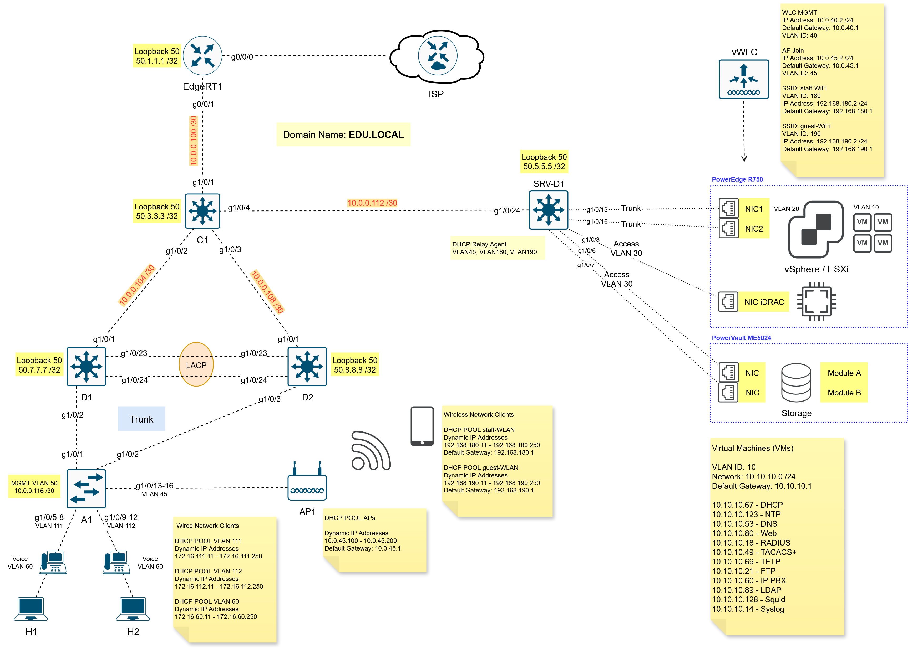

# Cisco vWLC (Virtual Wireless LAN Controller)

## Deploying the Cisco Catalyst 9800-CL on VMware ESXi

Software Download Link
https://software.cisco.com/download/home

> **Download File: C9800-CL-universalk9.17.15.03.ova**  
> Select a Product -> Browse all -> Wireless -> Wireless LAN Controller -> Standalone Controllers -> Catalyst 9800 Wireless Controllers for Cloud -> Catalyst 9800-CL Wireless Controller for Cloud -> IOS XE Software -> Cisco Catalyst 9800 Wireless Controller for Cloud - Hyper-V / ESXi / KVM -> download file: C9800-CL-universalk9.17.15.03.ova  

### 🖧 Network Topology



**HeadQuarters (HQ)**

| VLAN ID | VLAN Name  | Network Address  | Device         | Description                     |
|---------|------------|------------------|----------------|---------------------------------|
| 10      | VMs        | 10.1.10.0/24     | SRV-D1, SRV-D2 | Virtual Machines (VMs)          |
| 20      | ESXi       | 172.20.1.0/24    | SRV-D1, SRV-D2 | ESXi                            |
| 30      | iDRAC      | 172.30.1.0/24    | SRV-D1, SRV-D2 | iDRAC/iLO Management interface  |
| 40      | WLC        | 10.1.40.0/24     | SRV-D1, SRV-D2 | WLC Management interface        |
| 45      | APs        | 10.1.45.0/24     | SRV-D1, SRV-D2 | AP (Access Point) Join VLAN     |
| 50      | MGMT       | 10.1.1.116/30    | A1, A2         | Access Switch Management (MGMT) |
| 60      | Voice      | 172.16.60.0/24   | D1, D2, A1, A2 | Voice VLAN                      |
| 111     | VLAN111    | 172.16.111.0/24  | D1, D2, A1, A2 | Wired Network Clients           |
| 112     | VLAN112    | 172.16.112.0/24  | D1, D2, A1, A2 | Wired Network Clients           |
| 180     | staff-WLAN | 192.168.180.0/24 | SRV-D1, SRV-D2 | Wireless Network Clients        |
| 190     | guest-WLAN | 192.168.190.0/24 | SRV-D1, SRV-D2 | Wireless Network Clients        |
| 777     | Native     | -                | -              | Native VLAN                     |
| 999     | unUsed     | -                | -              | unUsed VLAN                     |

**EdgeRT1**
```shell
ip nat inside source list NAT interface GigabitEthernet0/0/0 overload
ip access-list standard NAT
permit 10.0.40.0 0.0.0.255
permit 192.168.180.0 0.0.0.255
permit 192.168.190.0 0.0.0.255
```

**SRV-D1 (Distribution Switch)**
```shell
vlan 40
name vWLC
vlan 45
name APs

vlan 180
name staff-WLAN
vlan 190
name guest-WLAN

int vlan 40
ip address 10.0.40.1 255.255.255.0
no shutdown
int vlan 45
ip address 10.0.45.1 255.255.255.0
no shutdown

int vlan 180
ip address 192.168.180.1 255.255.255.0
no shutdown
int vlan 190
ip address 192.168.190.1 255.255.255.0
no shutdown

router ospf 1
network 10.0.40.0 0.0.0.255 area 0
network 10.0.45.0 0.0.0.255 area 0
network 192.168.180.0 0.0.0.255 area 0
network 192.168.190.0 0.0.0.255 area 0

int range Gi1/0/21-22
description "Connetcted to APs"
switchport mode access
switchport access vlan 45

ip dhcp pool APs
network 10.0.45.0 255.255.255.0
default-router 10.0.45.1
dns-server 8.8.8.8
domain-name edu.local
lease 7

ip dhcp excluded-address 10.0.45.1 10.0.45.100
ip dhcp excluded-address 10.0.45.200 10.0.45.254

ip dhcp pool staff-WLAN
network 192.168.180.0 255.255.255.0
default-router 192.168.180.1
dns-server 8.8.8.8
domain-name edu.local
lease 7

ip dhcp excluded-address 192.168.180.1 192.168.180.10
ip dhcp excluded-address 192.168.180.251 192.168.180.254

ip dhcp pool guest-WLAN
network 192.168.190.0 255.255.255.0
default-router 192.168.190.1
dns-server 8.8.8.8
domain-name edu.local
lease 7

ip dhcp excluded-address 192.168.190.1 192.168.190.10
ip dhcp excluded-address 192.168.190.251 192.168.190.254

show ip dhcp pool
show ip dhcp binding
show ip dhcp server statistics
```

**Configure vWLC using CLI**

```shell
vlan 40
name MGMT
vlan 45
name APs

vlan 180
name staff-WLAN
vlan 190
name guest-WLAN

int vlan 40
ip address 10.0.40.2 255.255.255.0
no shutdown
int vlan 45
ip address 10.0.45.2 255.255.255.0
no shutdown

int vlan 180
ip address 192.168.180.2 255.255.255.0
no shutdown
int vlan 190
ip address 192.168.190.2 255.255.255.0
no shutdown

ping 10.0.40.1
ping 10.0.45.1
ping 192.168.180.1
ping 192.168.190.1

// Configure the Administrator User
username student privilege 15 secret class@123

// Configure the Wireless Management interface and Allow Management via Wireless 
wireless managemet interface vlan 40
exit
wireless mgmt-via-wireless

// Now we must temporarily disable the 2.4GHz, 5GHz, 6GHz bands
ap dot11 24ghz shutdown
ap dot11 5ghz shutdown
ap dot11 6ghz shutdown

// Configure the AP Country Code
ap country KZ

// Re-enable the bands
no ap dot11 5ghz shutdown
no ap dot11 24ghz shutdown
no ap dot11 6ghz shutdown

// Configure the WLC to sync time with an NTP server
ip route 0.0.0.0 0.0.0.0 10.0.40.1
ping ntp.nic.kz
ping 80.241.0.72
ntp server 80.241.0.72

// Generating the Self-Signed Certificate
SRV-D1# wireless config vwlc-ssc key-size 2048 signature-algo sha256 password 0 class@123

show wireless management trustpoint

copy run start
```
```shell
show wireless stats ap join summary
show ap tag summary
show ap uptime
show wlan summary
```

**Configure vWLC using Web UI**
```shell
Browser -> https://10.0.40.2
Browser -> https://public_ip_address:40443
```

```shell
1-қадам: Monitoring -> Wireless -> AP Statistics
```

```shell
2-қадам: Configuration -> Layer2 -> VLAN
```

```shell
3-қадам: Configuration -> Tags & Profiles -> WLANs -> Add ->
General ->
        -> Profile Name: STAFF_WLAN
        -> SSID: staff-WiFi
        -> Status: Enabled
        -> 6 GHz Status: Disabled

Security -> Layer2 -> Auth Key Mgmt (AKM) -> PSK -> Pre-Shared Key: Staff@123
Apply to Device
```

```shell
4-қадам: Configuration -> Tags & Profiles -> Policy -> Add -> 
General ->
        -> Name: POLICY_PROFILE_STAFF
        -> Description: POLICY PROFILE STAFF
        -> Status: Enabled

Access Policies -> VLAN/VLAN Group: staff-WiFi
Apply to Device
```

```shell
5-қадам: Configuration -> Tags & Profiles -> Tags -> Policy -> Add ->
        -> Name: POLICY_TAG_STAFF
        -> Description: POLICY TAG STAFF
        -> WLAN-POLICY Maps: -> Add -> WLAN Profile: WLAN_STAFF
        -> WLAN-POLICY Maps: -> Add -> Policy Profile: POLICY_PROFILE_STAFF
Apply to Device
```

```shell
6-қадам: Configuration -> Tags & Profiles -> AP Join -> Add ->
General ->
        -> Name: AP_PROFILE_STAFF
        -> Description: AP PROFILE STAFF
        -> Country Code: KZ
        -> Time Zone: Use-Controller
        -> NTP Server: 80.241.0.72
Apply to Device
```

```shell
7-қадам: Configuration -> Tags & Profiles -> Tags -> Site -> Add ->
        -> Name: SITE_TAG_STAFF
        -> Description: SITE TAG STAFF
        -> AP Join Profile: AP_PROFILE_STAFF
Apply to Devic
```
```shell
8-қадам: Configuration -> Tags & Profiles -> RF/Radio -> RF -> Add ->
General ->
        -> Name: RF_PROFILE_STAFF_2.4GHz
        -> Radio Band: 2.4 GHz Band
        -> Status: Enabled
        -> Description: RF PROFILE STAFF 2.4GHz
Apply to Device

General ->
        -> Name: RF_PROFILE_STAFF_5GHz
        -> Radio Band: 5 GHz Band
        -> Status: Enabled
        -> Description: RF PROFILE STAFF 5GHz
Apply to Device
```

```shell
9-қадам: Configuration -> Tags & Profiles -> Tags -> RF -> Add ->
        -> Name: RF_TAG_STAFF
        -> Description: RF TAG STAFF
        -> 5 GHz Band RF Profile: RF_PROFILE_STAFF_5GHz
        -> 2.4 GHz Band RF Profile: RF_PROFILE_STAFF_2.4GHz
Apply to Device
```

```shell
10-қадам: Configuration -> Wireless -> Access Points

Тізімде көрсетілген Access Point-тың үстінен тінтуірмен басамыз!
Мысалы: AIR-CAP2702E-E-K9 

General -> Tags ->
                -> Policy: POLICY_TAG_STAFF
                -> Site: SITE_TAG_STAFF
                -> RF: RF_TAG_STAFF
Update & Apply to Device

AP Operational Configuration Viewer
```

## References
1) [Cisco Catalyst 9800-CL Wireless Controller for Cloud Deployment Guide](https://www.cisco.com/c/en/us/td/docs/wireless/controller/9800/technical-reference/c9800-cl-dg.html)
2) [Understand Catalyst 9800 Wireless Controllers Configuration Model](https://www.cisco.com/c/en/us/support/docs/wireless/catalyst-9800-series-wireless-controllers/213911-understand-catalyst-9800-wireless-contro.html)
3) [Deploying and Configuring the Cisco Catalyst 9800-CL in VMware ESXi](https://www.wifireference.com/2019/08/24/cisco-catalyst-9800-cl-deployment-guide/)

## YouTube
1) [Install Cisco C9800-CL in VMWare ESXI 7 | Joining AP](https://youtu.be/mI6q8pkXKZI)
2) [Install Cisco Wireless LAN Controller C9800-CL | Joining AP](https://youtu.be/ef4amrMiyaY)
3) [Cisco 9800 VMware ESXi install](https://youtu.be/S4qYimtm2mQ)
4) [Deploying the Cisco Catalyst 9800-CL in VMware ESXi](https://youtu.be/DqqjF2FH_Zw)
